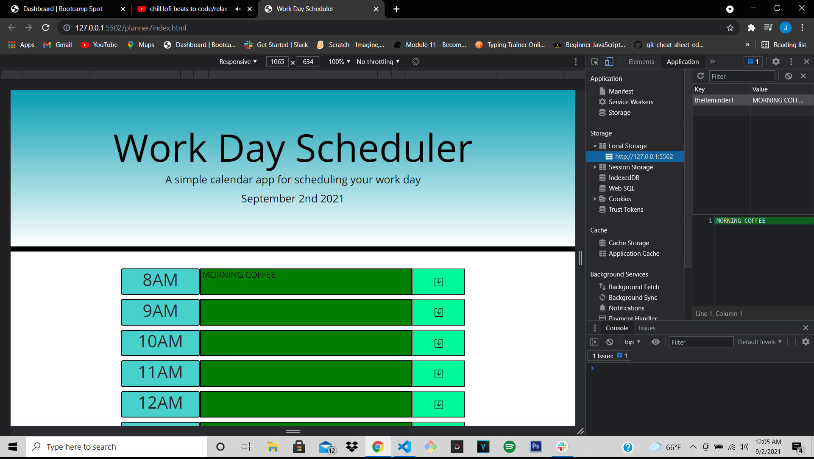

# Work Day Scheduler

This is a Work Day Scheduler created to help the user set a schedule for their work day.
The app was created using html, css, javascript, moment.js, amd some bootstrap. With the 
help of local storage, this app is able to you give you precise functionality. When an there
is an available open slot, the textarea bar will be green, when is time to apply that action,
the etxt area bar will turn red, and when the time has passed, the bar will turn gray.

here is a screenshot of the app with an open console so you can see it was successfuly stored

